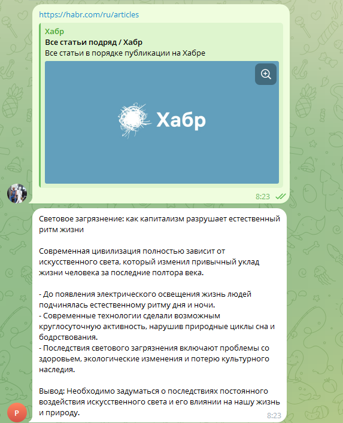

# Telegram AI Gateway

Production-ready Telegram-бот для переработки статей в структурированные посты с использованием n8n и GigaChat API.

Отправьте ссылку на статью — получите готовый пост для Telegram.

[](https://docs.n8n.io/)
[](LICENSE)

---

## Возможности

- 📥 Приём URL статьи из Telegram
- 🧹 Очистка текста от мусора
- 🤖 Генерация поста через GigaChat API
- ✂️ Разбиение длинных сообщений
- 🔧 Полноценная обработка ошибок
- 📊 Логирование выполнения

---

## Скриншоты

### Успешный сценарий



Пользователь отправляет ссылку, бот возвращает структурированный пост.

### Архитектура workflow


Поток обработки: Telegram Trigger → Load Page → Extract Article → Clean Text → GigaChat → Split Message → Send Message.

### Логирование


Вспомогательный workflow для записи логов в PostgreSQL.

### Обработка ошибок


Пользовательские сообщения на русском языке при ошибках загрузки, авторизации и API.

---

## Быстрый старт

### Требования

- Docker и Docker Compose
- Telegram Bot Token (от [@BotFather](https://t.me/botfather))
- GigaChat API credentials

### Установка

```bash
# Клонируйте репозиторий
git clone https://github.com/AlexLvGulyaev/telegram-ai-gateway.git
cd telegram-ai-gateway

# Создайте .env файл
cp .env.example .env

# Отредактируйте .env
# Укажите свои credentials для Telegram и GigaChat

# Запустите
docker-compose up -d

# Откройте n8n
# http://localhost:5678
```

### Настройка

1. Импортируйте workflow из `workflows/Telegram AI Gateway.json`
2. Создайте credentials в n8n:
   - Telegram Bot API
   - GigaChat Basic Auth
   - PostgreSQL (для Log Writer)
3. Активируйте workflow

**Подробное руководство:** [Deployment Guide](docs/deployment_guide.md)

---

## Архитектура

```
Telegram → n8n Workflow → GigaChat API → Telegram
                │
                └─→ PostgreSQL (logs)
```

Пользователь отправляет URL в Telegram → workflow загружает статью → очищает текст → генерирует пост через GigaChat → возвращает результат.

**Подробнее:** [Architecture](docs/architecture.md)

---

## Документация

| Документ | Назначение |
|----------|------------|
| [Deployment Guide](docs/deployment_guide.md) | Развёртывание на VPS |
| [Architecture](docs/architecture.md) | Архитектура системы |
| [Workflow Overview](docs/workflow_overview.md) | Описание workflow и нод |
| [Credentials Setup](docs/credentials-setup.md) | Настройка credentials |
| [Limitations](docs/limitations.md) | Ограничения проекта |
| [Known Issues](docs/known_issues.md) | Известные проблемы |

---

## Статус

**Версия:** 2.0

**Что реализовано:**
- ✅ Полноценная обработка ошибок
- ✅ Retry механизмы
- ✅ Логирование в PostgreSQL
- ✅ Разбиение длинных сообщений

**Релиз:** GitHub Edition — Error Handling Complete

---

## Лицензия

MIT License. См. [LICENSE](LICENSE).

---

## Автор

AI Automation Portfolio Lab