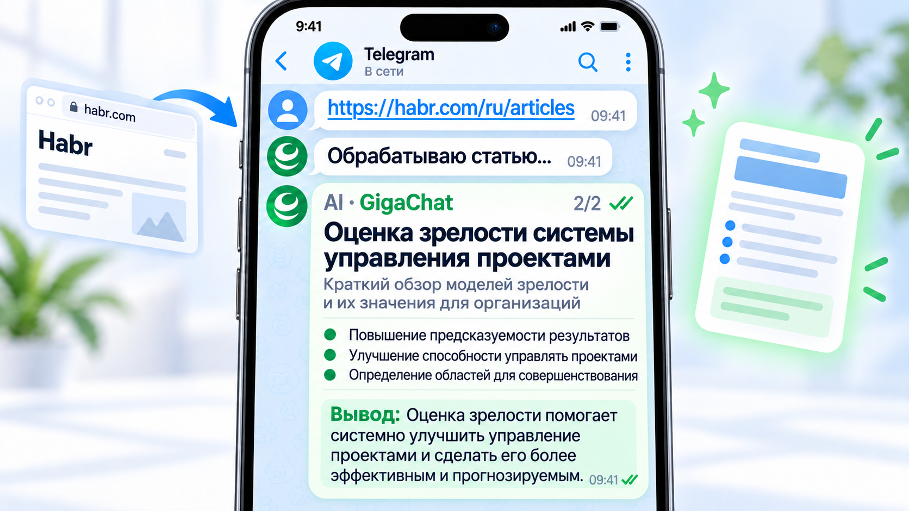
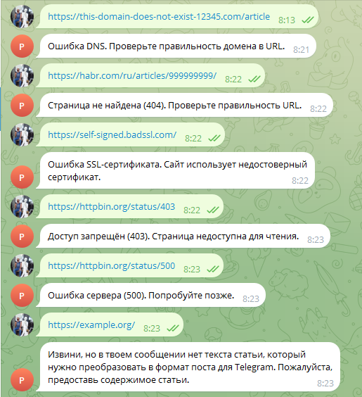
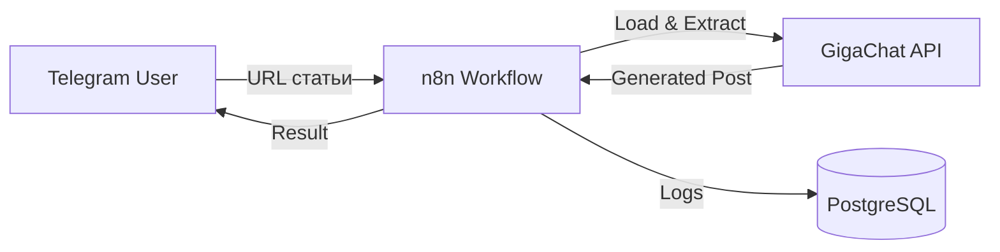

# 🌐 Telegram AI Gateway



⚡ **Превратите ссылку на статью в готовый пост для Telegram-канала: бот сам загрузит статью, очистит текст, выделит суть через GigaChat и доставит результат — с журналированием каждого шага.**

Telegram-бот, который берёт на себя рутину контент-менеджера: принимает ссылку на статью, извлекает и очищает текст, формирует структурированный пост через GigaChat и отправляет его в чат. Больше не нужно вручную вырезать рекламу, сокращать длинные статьи до формата канала и переформатировать текст под Telegram — отправили ссылку, получили пост.

- Отправляете ссылку на статью — бот возвращает готовый структурированный пост: очистка текста, выжимка через GigaChat, форматирование под Telegram; если пост длиннее лимита (4096 символов), он автоматически разбивается на части.
- Отправляете недоступную ссылку — вместо молчания получаете внятное сообщение на русском: бот различает DNS-ошибки, HTTP-статусы (404, 403, 500) и проблемы SSL, а весь прогон фиксируется в PostgreSQL с уникальным `request_id`.

[](https://docs.n8n.io/)
[](LICENSE)

[💼 Бизнес-ценность](docs/business_value.md) · [📖 Юзер-гайд](docs/user_guide.md) · [🚀 Развёртывание](docs/deployment_guide.md)

---

## ▶️ 1. Демо

### Успешная обработка статьи


Пользователь отправляет ссылку на статью — бот возвращает структурированный пост, готовый к публикации в канале.

### Обработка ошибок



Пользовательские сообщения на русском языке: система различает DNS-ошибки, HTTP-статусы (404, 403, 500), SSL-проблемы и ошибки AI-сервиса — читатель всегда понимает, что произошло и что делать дальше.

Все сообщения и правила работы с ботом — в [docs/user_guide.md](docs/user_guide.md).

---

## ❓ 2. Зачем нужен

Ручная переработка статьи в пост для Telegram — это рутина, которую контент-менеджеры и редакторы повторяют ежедневно:

- прочитать длинную статью и вырезать из неё рекламу, навигацию и мусор;
- выделить главное и сократить до формата канала;
- отформатировать текст под Telegram, следя за лимитом в 4096 символов.

На одну статью уходят десятки минут однообразной работы, а качество зависит от загрузки и настроения исполнителя.

**Telegram AI Gateway решает эту проблему:** отправка ссылки превращается в готовый пост за один шаг, каждый прогон журналируется в PostgreSQL, а ошибки обрабатываются понятными сообщениями — процесс становится повторяемым и измеримым.

Больше о бизнес-ценности — в [docs/business_value.md](docs/business_value.md).

---

## 🎯 3. Для кого

- Контент-менеджеры и редакторы Telegram-каналов, перерабатывающие внешние статьи в посты.
- Авторы, ведущие несколько каналов и экономящие время на рутинной подготовке текста.
- Команды, которым важна измеримость: журнал исполнения каждого прогона с `request_id`.
- Инженеры, которым нужен готовый образец production-grade n8n-автоматизации с обработкой ошибок и логированием.

---

## ✨ 4. Возможности

- **Ссылка → пост в одном сообщении** — загрузка страницы, очистка текста, генерация через GigaChat и доставка в Telegram: один pipeline от триггера до ответа.
- **Понятные сообщения об ошибках** — бот различает DNS-ошибки, HTTP-статусы (404, 403, 500), SSL-проблемы и ошибки AI-сервиса; тексты сообщений на русском и настраиваются параметрами.
- **Журналирование в PostgreSQL** — отдельный Log Writer workflow записывает каждый этап с `request_id`: любой прогон можно разобрать по шагам.
- **Разбиение длинных постов** — сообщение длиннее 4096 символов автоматически делится на части.
- **27 параметров конфигурации** — модель, промпт, лимиты текста, таймауты, CSS-селекторы извлечения: вся настройка через Configuration node, без правки кода.
- **Провайдер-независимость** — параметр `AI_PROVIDER` (сейчас GigaChat) и `CONTENT_SOURCE` (сейчас URL): замена LLM-провайдера или источника контента без перестройки workflow.

---

## 🏗️ 5. Краткий обзор архитектуры



Пользователь отправляет URL в Telegram → workflow загружает статью → очищает текст → генерирует пост через GigaChat → возвращает результат; параллельно каждый этап записывается в PostgreSQL через отдельный Log Writer workflow.

**Подробнее:** [Architecture](docs/architecture.md)

---

## 🛠️ 6. Технологический стек

| Компонент | Технология |
|-----------|------------|
| Workflow-движок | [n8n](https://docs.n8n.io/) 2.29.8 |
| AI-модель | [GigaChat API](https://giga.chat/) (OAuth + Chat Completions) |
| База данных | PostgreSQL 15 (credentials, execution history, логи `workflow_logs`) |
| Интерфейс | Telegram Bot API |
| Развёртывание | Docker Compose (n8n + PostgreSQL) |

---

## 🚀 7. Быстрый старт

### Требования

- Docker и Docker Compose
- Telegram Bot Token (от [@BotFather](https://t.me/botfather))
- GigaChat API credentials

### Установка

```bash
# Клонируйте репозиторий
git clone https://github.com/AlexLvGulyaev/telegram-ai-gateway.git
cd telegram-ai-gateway

# Создайте .env файл
cp .env.example .env

# Отредактируйте .env
# Укажите свои credentials для Telegram и GigaChat

# Запустите
docker-compose up -d

# Откройте n8n
# http://localhost:5678
```

### Настройка

1. Импортируйте workflow из `workflows/Telegram AI Gateway.json`
2. Создайте credentials в n8n:
   - Telegram Bot API
   - GigaChat Basic Auth
   - PostgreSQL (для Log Writer)
3. Примените миграции и активируйте workflow

**Подробное руководство:** [Deployment Guide](docs/deployment_guide.md) — развёртывание на VPS с HTTPS и локальный Docker-режим; эксплуатация — [Operations Guide](docs/operations.md).

---

## 📚 8. Документация

Документация разделена по аудиториям — каждому читателю свой вход.

### Для заказчиков и менеджеров

| Документ | О чём |
|----------|-------|
| [Business Value](docs/business_value.md) | Бизнес-ценность: какую рутину снимает, кому полезен, модель ценности |
| [SPEC](docs/SPEC.md) | Какими возможностями обладает продукт, для кого, метрики качества |

### Для пользователей и операторов

| Документ | О чём |
|----------|-------|
| [User Guide](docs/user_guide.md) | Как пользоваться ботом: сообщения об ошибках, советы |
| [Deployment Guide](docs/deployment_guide.md) | Развёртывание (VPS + HTTPS / локальный Docker), чеклист Deployment Validation |
| [Operations Guide](docs/operations.md) | Эксплуатация: мониторинг, бэкап, обновление, безопасность, troubleshooting |
| [Credentials Setup](docs/credentials-setup.md) | Настройка credentials: Telegram, GigaChat, PostgreSQL |
| [Limitations](docs/limitations.md) | Ограничения платформы, известные проблемы и обходные пути |

### Для инженеров и интеграторов

| Документ | О чём |
|----------|-------|
| [Architecture](docs/architecture.md) | C4-диаграммы, устройство workflow (ноды, конфигурация), журналирование исполнения, архитектурные решения, результаты инженерного тестирования |
| [PROJECT_STATE](docs/PROJECT_STATE.md) | Паспорт состояния проекта |
| [CHANGE_LOG](docs/CHANGE_LOG.md) | История изменений документации |

---

## 📁 9. Структура проекта

```
telegram-ai-gateway/
├── workflows/              # Main workflow (39 нод) и Log Writer (4 ноды) для импорта в n8n
├── migrations/             # SQL-миграции: таблица workflow_logs
├── scripts/                # Служебные скрипты (validate-deployment.sh)
├── docs/                   # Документация по трём аудиториям + скриншоты
├── docker-compose.yml      # n8n + PostgreSQL
├── docker-compose.test.yml # Тестовая конфигурация
└── .env.example            # Шаблон переменных окружения
```

---

## ✅ 10. Статус проекта

**Production Ready (GitHub Edition)** — Deployment Validation пройдена в чистом окружении: проект воспроизводится с нуля по [Deployment Guide](docs/deployment_guide.md), без знаний автора за пределами публичной документации.

**Что реализовано:**

- ✅ Полный pipeline URL → структурированный пост
- ✅ Обработка ошибок с user-friendly сообщениями на русском
- ✅ Журналирование каждого прогона в PostgreSQL
- ✅ Разбиение длинных сообщений

---

## ⚠️ 11. Ограничения

- **Время выполнения растёт с объёмом статьи** — для длинных текстов есть оперативный обход (уменьшение лимитов текста/промпта); см. [Limitations](docs/limitations.md).
- **Внешние зависимости** — доступность исходного сайта, GigaChat API и Telegram API влияет на обработку; сбой вызова завершается понятным сообщением об ошибке.
- **Качество генерации зависит от модели** — пост формируется GigaChat; промпт настраивается параметрами, но результат стоит проверять перед публикацией.

Полный перечень ограничений и известных проблем: [Limitations](docs/limitations.md).

---

## 📄 12. Лицензия

MIT — см. [LICENSE](LICENSE).

> ℹ️ Бот разработан с использованием инженерных практик AI Automation
> Portfolio Lab как среды разработки. Публичная документация полностью
> самодостаточна и не ссылается на внутренние артефакты лаборатории.

---

**Статус:** Production Ready — Deployment Validation пройдена
**Последнее обновление:** 2026-09-16
**История изменений:** [📝 CHANGE_LOG.md](docs/CHANGE_LOG.md#-1-история-изменений-документации)