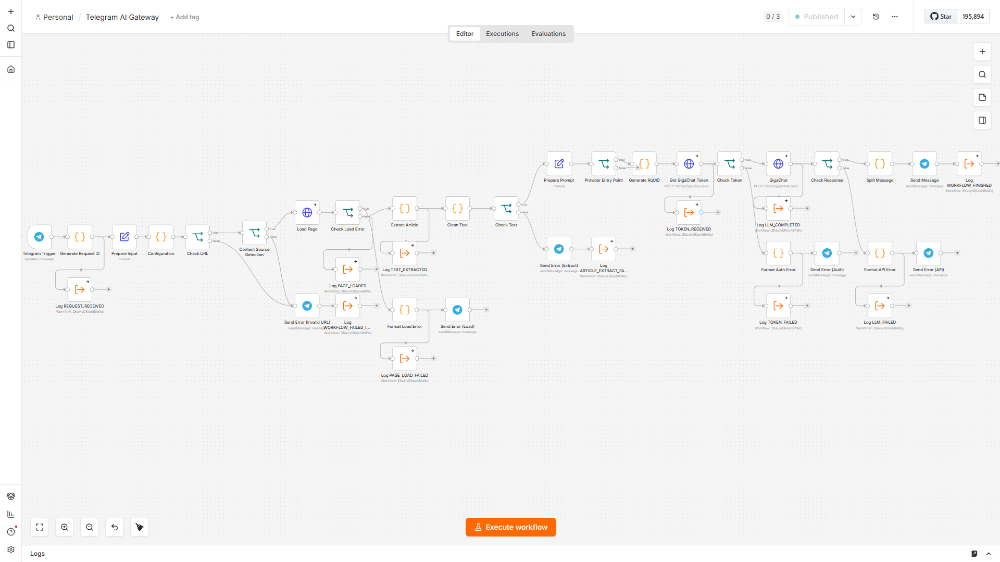
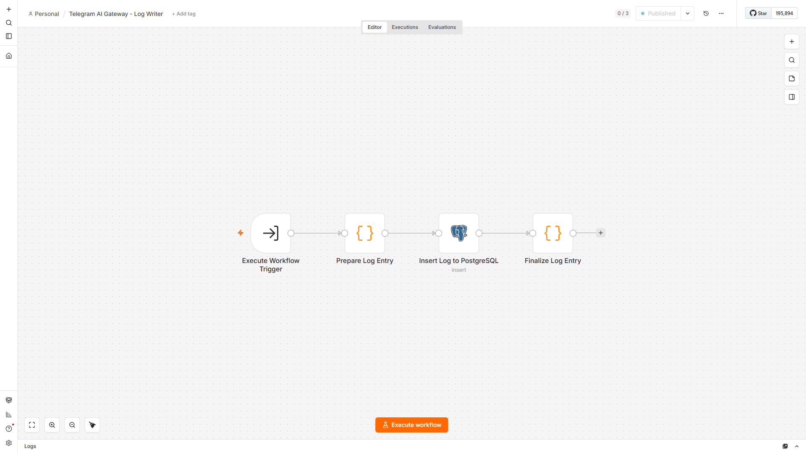
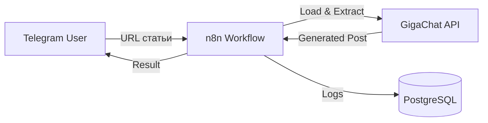

# 🌐 Telegram AI Gateway

Production-ready Telegram-бот для переработки статей в структурированные посты с использованием n8n и GigaChat API.

Отправьте ссылку на статью — получите готовый пост для Telegram.

[](https://docs.n8n.io/)
[](LICENSE)

---

## ✨ 1. Возможности

- 📥 Приём URL статьи из Telegram
- 🧹 Очистка текста от мусора
- 🤖 Генерация поста через GigaChat API
- ✂️ Разбиение длинных сообщений
- 🔧 Обработка ошибок
- 📊 Логирование выполнения

---

## 🎬 2. Сценарии

### Успешная обработка статьи


Пользователь отправляет ссылку на статью — бот возвращает структурированный пост.

### Поток обработки



Маршрут обработки запроса: Telegram Trigger → Load Page → Extract Article → Clean Text → GigaChat → Split Message → Send Message.

### Журналирование выполнения



Система журналирования: Execute Workflow → Log Writer → PostgreSQL. Каждый этап выполнения записывается с request_id для трассировки.

### Обработка ошибок


Пользовательские сообщения на русском языке при ошибках загрузки, авторизации и API. Система различает DNS-ошибки, HTTP-статусы (404, 403, 500), SSL-проблемы и ошибки AI-сервиса.

---

## 🚀 3. Быстрый старт

### Требования

- Docker и Docker Compose
- Telegram Bot Token (от [@BotFather](https://t.me/botfather))
- GigaChat API credentials

### Установка

```bash
# Клонируйте репозиторий
git clone https://github.com/AlexLvGulyaev/telegram-ai-gateway.git
cd telegram-ai-gateway

# Создайте .env файл
cp .env.example .env

# Отредактируйте .env
# Укажите свои credentials для Telegram и GigaChat

# Запустите
docker-compose up -d

# Откройте n8n
# http://localhost:5678
```

### Настройка

1. Импортируйте workflow из `workflows/Telegram AI Gateway.json`
2. Создайте credentials в n8n:
   - Telegram Bot API
   - GigaChat Basic Auth
   - PostgreSQL (для Log Writer)
3. Активируйте workflow

**Подробное руководство:** [Deployment Guide](docs/deployment_guide.md)

---

## 🏗️ 4. Архитектура



Пользователь отправляет URL в Telegram → workflow загружает статью → очищает текст → генерирует пост через GigaChat → возвращает результат.

**Подробнее:** [Architecture](docs/architecture.md)

---

## 📚 5. Документация

Маршрут: «какой документ для какого вопроса».

| Вопрос | Документ |
|--------|----------|
| Как развернуть и эксплуатировать (VPS + HTTPS / локальный Docker, troubleshooting, бэкап, обновление) | [Deployment Guide](docs/deployment_guide.md) |
| Как настроить credentials | [Credentials Setup](docs/credentials-setup.md) |
| Как устроена система (C4-диаграммы, потоки данных, обработка ошибок, безопасность) | [Architecture](docs/architecture.md) |
| Как работает workflow изнутри (ноды, версии workflow, переменные окружения) | [Workflow Overview](docs/workflow_overview.md) |
| Как устроено журналирование исполнения | [Logging Integration Guide](docs/logging-integration-guide.md) |
| Какими возможностями обладает продукт и для кого | [SPEC](docs/SPEC.md) |
| В каком состоянии находится проект | [PROJECT_STATE](docs/PROJECT_STATE.md) |
| Какие архитектурные решения приняты и почему | [Architecture Decisions](docs/architecture-decisions.md) |
| Какие известны проблемы и как их обходить | [Known Issues](docs/known_issues.md) |
| Какие есть ограничения платформы | [Limitations](docs/limitations.md) |
| Какие негативные сценарии протестированы | [Negative Tests](docs/negative_tests.md) |
| Как выбиралась версия n8n (историческое исследование) | [Engineering Investigation](docs/engineering-investigation-n8n-update.md) |
| Как планировалась реализация (архивный план) | [Implementation Plan](docs/IMPLEMENTATION_PLAN.md) |
| Что менялось в документации | [CHANGE_LOG](docs/CHANGE_LOG.md) |

---

## ✅ 6. Статус

**Что реализовано:**
- ✅ Обработка ошибок
- ✅ Retry механизмы
- ✅ Логирование в PostgreSQL
- ✅ Разбиение длинных сообщений

**Релиз:** GitHub Edition — Production Ready (Deployment Validation пройдена)

---

## 📄 7. Лицензия

MIT License. См. [LICENSE](LICENSE).

---

## 👥 8. Автор

AI Automation Portfolio Lab

---

**Статус:** Production Ready
**Последнее обновление:** 2026-09-16
**История изменений:** [📝 CHANGE_LOG.md](docs/CHANGE_LOG.md#-1-история-изменений-документации)
