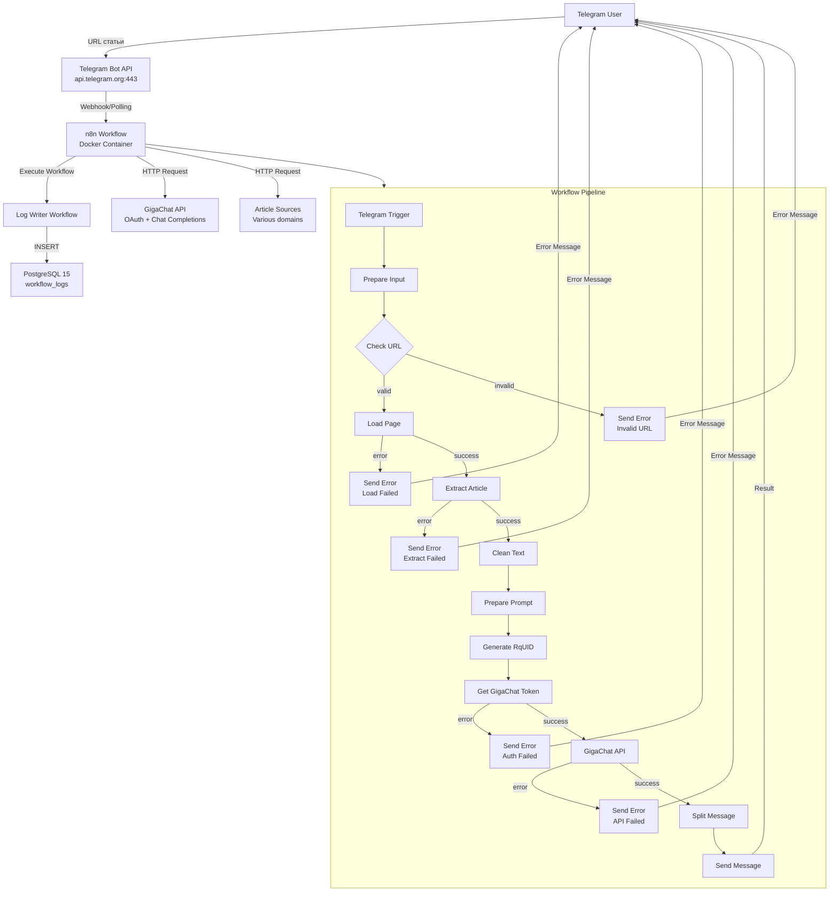
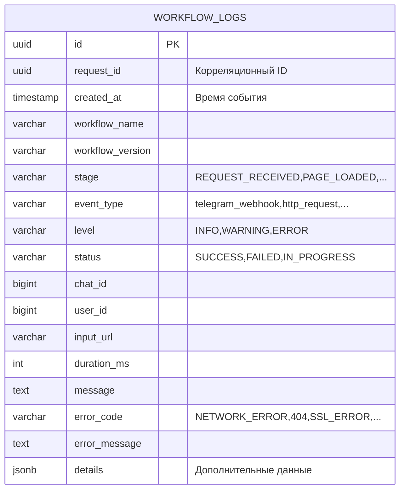
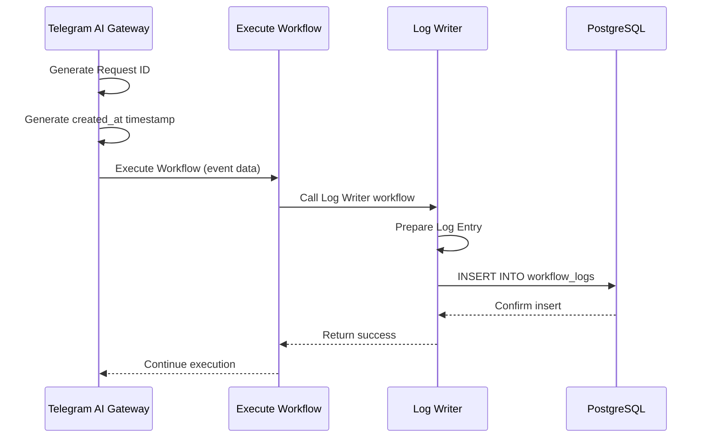
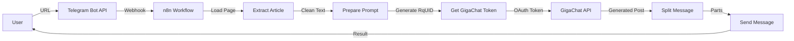
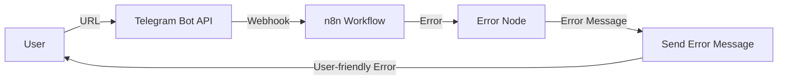
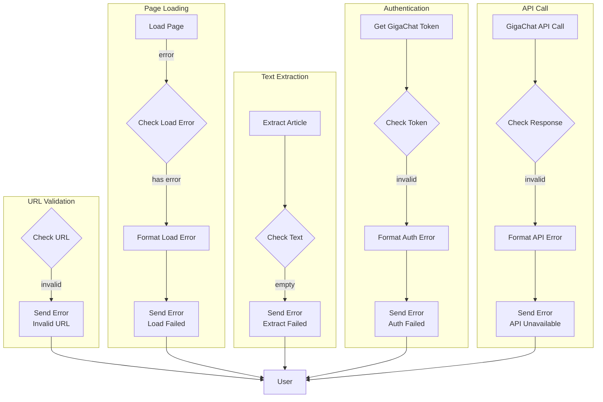

# Architecture

Документ описывает архитектуру проекта Telegram AI Gateway.

## Высокоуровневая архитектура



## Компоненты системы

### Docker Services

| Сервис | Образ | Назначение |
|--------|-------|-----------|
| n8n | n8nio/n8n:2.29.8 | Workflow engine |
| postgres | postgres:15-alpine | База данных n8n |

### n8n Workflows

**Основной workflow:** Telegram AI Gateway

**Тип:** Event-driven workflow с линейной обработкой

**Триггер:** Telegram Trigger (On Message)

**Ноды:** 39 nodes (28 основных + 11 Execute Workflow для логирования)

**Log Writer workflow:** Telegram AI Gateway - Log Writer

**Тип:** Reusable workflow для логирования

**Ноды:** 4 nodes

### База данных

**PostgreSQL 15:**
- Хранит credentials n8n
- Хранит execution history
- Хранит workflow definitions
- Хранит таблицу workflow_logs для журналирования

#### Архитектура данных



#### Поток записи логов



**Подробности логирования:** [logging-integration-guide.md](logging-integration-guide.md)

### Внешние интеграции

**Telegram Bot API:**
- Endpoint: `api.telegram.org`
- Методы: `getMe`, `sendMessage`
- Аутентификация: Bot Token

**GigaChat API:**
- OAuth endpoint: `ngw.devices.sberbank.ru:9443/api/v2/oauth`
- Chat endpoint: `gigachat.devices.sberbank.ru/api/v1/chat/completions`
- Аутентификация: Basic Auth → Bearer Token

## Потоки данных

### Успешный сценарий



### Сценарий с ошибкой



## Обработка ошибок

### Уровни обработки

**1. Node Level:**
- Continue on Fail для HTTP Request нод
- Error output для критических нод

**2. Workflow Level:**
- Error flow для отправки сообщений об ошибках
- User-friendly error messages

**3. Retry Level:**
- Retry для Load Page (3 попытки)
- Retry для Get GigaChat Token (2 попытки)
- Retry для GigaChat (2 попытки)

### Error Flow Diagram



## Безопасность

### Секреты

**Хранение:**
- Все секреты в `.env` файле
- `.env` добавлен в `.gitignore`
- n8n credentials в зашифрованном виде в PostgreSQL

**Переменные окружения:**
- `TELEGRAM_BOT_TOKEN` — токен Telegram-бота
- `GIGACHAT_AUTH_BASIC` — Base64-encoded GigaChat credentials
- `N8N_BASIC_AUTH_PASSWORD` — пароль для n8n admin

### Сетевая безопасность

**Требования:**
- HTTPS для webhook (опционально)
- HTTPS для внешних API
- Изоляция в Docker network

**Рекомендации:**
- IP whitelisting для n8n admin interface
- Reverse proxy (Nginx/Caddy) для HTTPS
- Firewall rules для ограничения доступа

## Масштабируемость

### Текущие ограничения

- Один workflow instance
- PostgreSQL single instance
- Нет horizontal scaling

### Возможные улучшения

- Redis для кэширования
- PostgreSQL replicas для чтения
- Queue system для высокой нагрузки
- Multiple n8n instances за load balancer

## Мониторинг

### Текущий мониторинг

- n8n execution history
- Docker logs
- PostgreSQL logs

### Рекомендуемый мониторинг

- Prometheus + Grafana
- Log aggregation (ELK/Loki)
- Alerting на ошибки
- Health checks

## Резервное копирование

### Что бэкапить

- PostgreSQL data volume
- n8n data volume
- `.env` файл (без секретов в git)

### Стратегия бэкапа

```bash
# Бэкап PostgreSQL
docker exec postgres pg_dump -U n8n n8n > backup_$(date +%Y%m%d).sql

# Бэкап n8n data
docker run --rm -v n8n_data:/data -v $(pwd):/backup alpine tar czf /backup/n8n_backup.tar.gz -C /data .
```