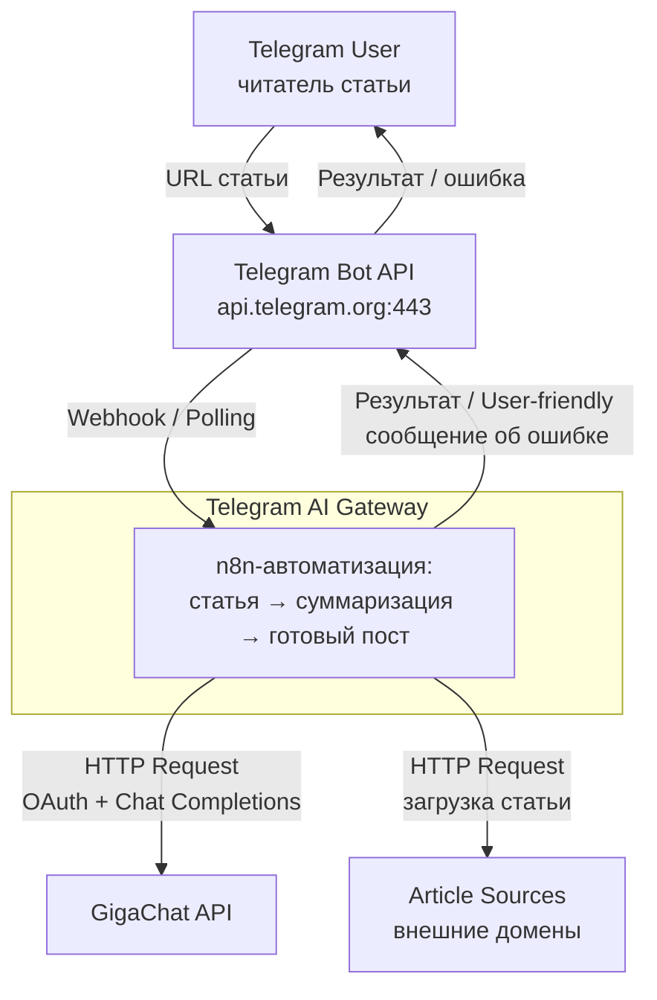
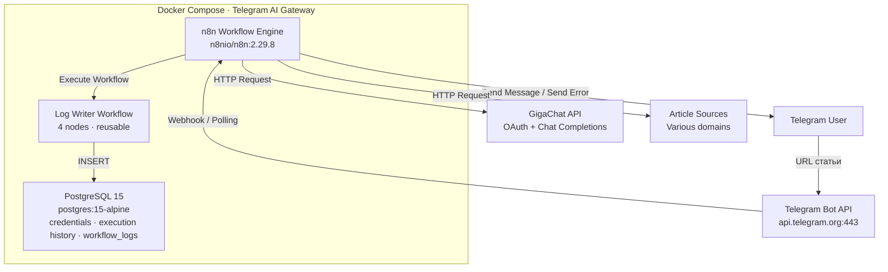
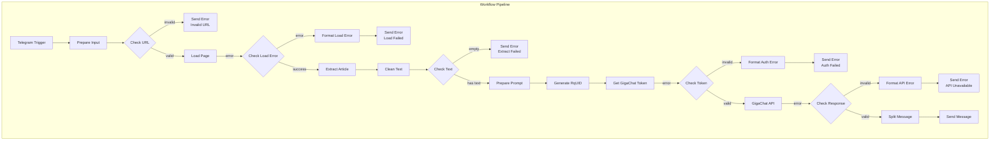
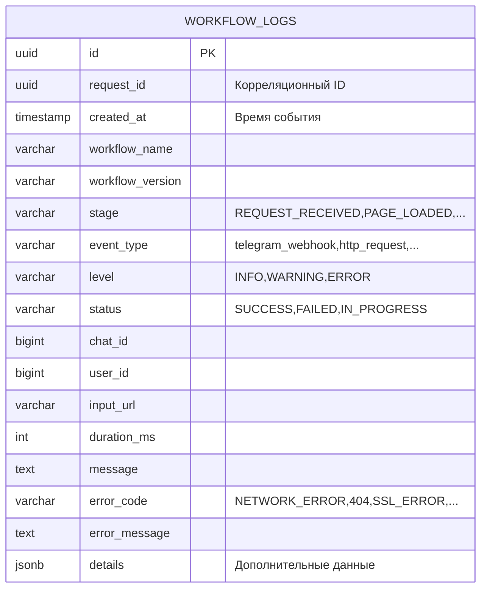
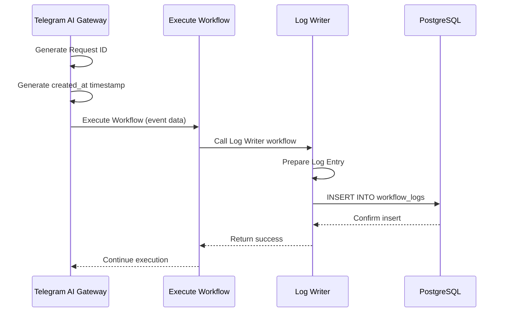
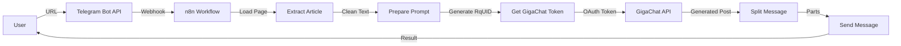
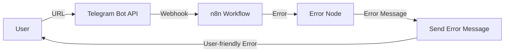
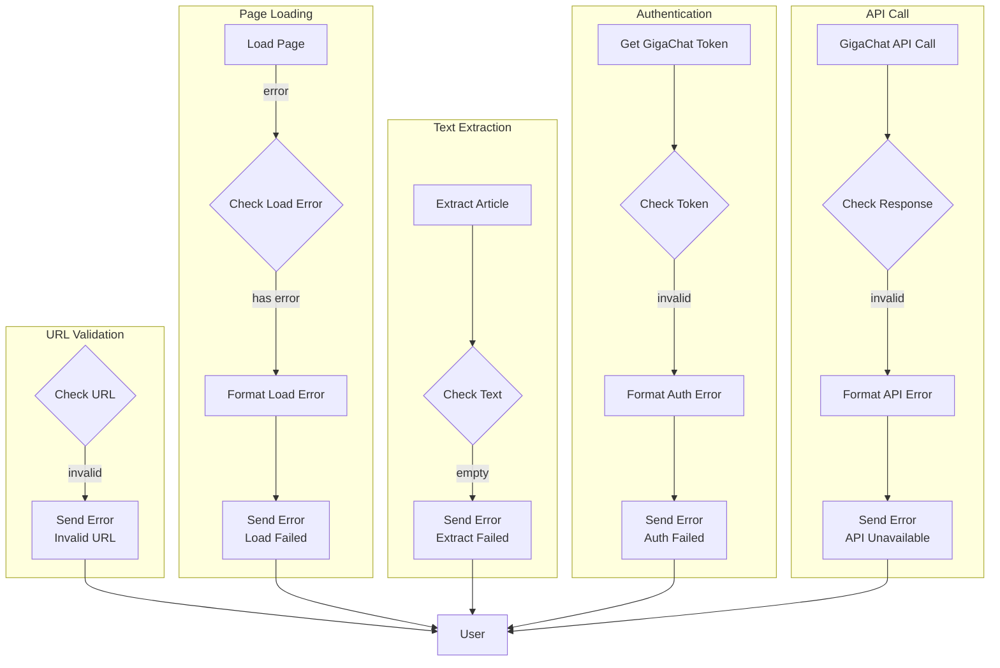

# 🏗️ Telegram AI Gateway · ARCHITECTURE

Документ описывает архитектуру проекта Telegram AI Gateway.

## 🌐 1. Context Diagram (C4 Level 1)

## 📦 2. Container Diagram (C4 Level 2)

### Внутренняя структура основного workflow

Retry-политики по нодам — [workflow_overview.md](workflow_overview.md); полный разбор ошибок — раздел «Обработка ошибок» ниже.

### Docker Services

| Сервис | Образ | Назначение |
|--------|-------|-----------|
| n8n | n8nio/n8n:2.29.8 | Workflow engine |
| postgres | postgres:15-alpine | База данных n8n |

### n8n Workflows

**Основной workflow:** Telegram AI Gateway

**Тип:** Event-driven workflow с линейной обработкой

**Триггер:** Telegram Trigger (On Message)

**Ноды:** 39 nodes (28 основных + 11 Execute Workflow для логирования)

**Log Writer workflow:** Telegram AI Gateway - Log Writer

**Тип:** Reusable workflow для логирования

**Ноды:** 4 nodes

### База данных

**PostgreSQL 15:**
- Хранит credentials n8n
- Хранит execution history
- Хранит workflow definitions
- Хранит таблицу workflow_logs для журналирования

#### Архитектура данных

#### Поток записи логов

**Подробности логирования:** [logging-integration-guide.md](logging-integration-guide.md)

### Внешние интеграции

**Telegram Bot API:**
- Endpoint: `api.telegram.org`
- Методы: `getMe`, `sendMessage`
- Аутентификация: Bot Token

**GigaChat API:**
- OAuth endpoint: `ngw.devices.sberbank.ru:9443/api/v2/oauth`
- Chat endpoint: `gigachat.devices.sberbank.ru/api/v1/chat/completions`
- Аутентификация: Basic Auth → Bearer Token

## 🔄 3. Потоки данных

### Успешный сценарий

### Сценарий с ошибкой

## 🚨 4. Обработка ошибок

### Уровни обработки

**1. Node Level:**
- Continue on Fail для HTTP Request нод
- Error output для критических нод

**2. Workflow Level:**
- Error flow для отправки сообщений об ошибках
- User-friendly error messages

**3. Retry Level:**
- Retry для Load Page (3 попытки)
- Retry для Get GigaChat Token (2 попытки)
- Retry для GigaChat (2 попытки)

### Error Flow Diagram

## 🔐 5. Безопасность

### Секреты

**Хранение:**
- Все секреты в `.env` файле
- `.env` добавлен в `.gitignore`
- n8n credentials в зашифрованном виде в PostgreSQL

**Переменные окружения:**
- `TELEGRAM_BOT_TOKEN` — токен Telegram-бота
- `GIGACHAT_AUTH_BASIC` — Base64-encoded GigaChat credentials
- `N8N_BASIC_AUTH_PASSWORD` — пароль для n8n admin

### Сетевая безопасность

**Требования:**
- HTTPS для webhook (опционально)
- HTTPS для внешних API
- Изоляция в Docker network

**Рекомендации:**
- IP whitelisting для n8n admin interface
- Reverse proxy (Nginx/Caddy) для HTTPS
- Firewall rules для ограничения доступа

## 📈 6. Масштабируемость

### Текущие ограничения

- Один workflow instance
- PostgreSQL single instance
- Нет horizontal scaling

### Возможные улучшения

- Redis для кэширования
- PostgreSQL replicas для чтения
- Queue system для высокой нагрузки
- Multiple n8n instances за load balancer

## 📊 7. Мониторинг

Текущий мониторинг (n8n execution history, Docker logs, structured logging) и рекомендуемый (Prometheus + Grafana, log aggregation, alerting) — [deployment_guide.md](deployment_guide.md), раздел «Мониторинг». Журналирование исполнения — [logging-integration-guide.md](logging-integration-guide.md).

## 💾 8. Резервное копирование

Бэкапятся: PostgreSQL data volume, n8n data volume, `.env` (без секретов в git). Команды и процедура — [deployment_guide.md](deployment_guide.md), раздел «Бэкап и восстановление».

---

**Статус:** Актуальна (as-built)
**Последнее обновление:** 2026-09-16
**История изменений:** [📝 CHANGE_LOG.md](CHANGE_LOG.md#-1-история-изменений-документации)
