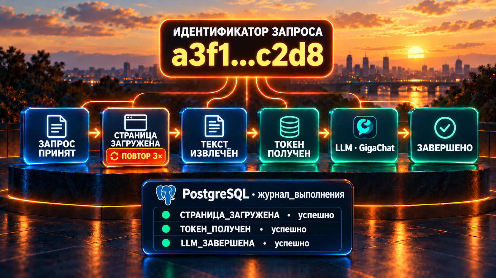
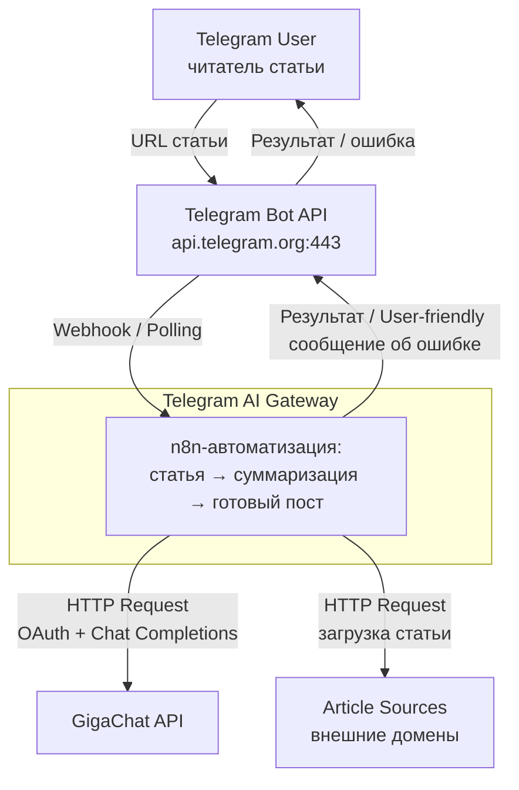
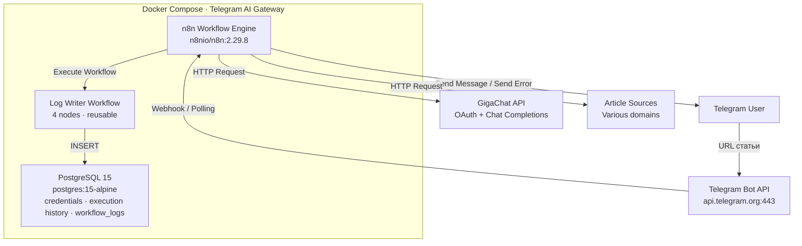
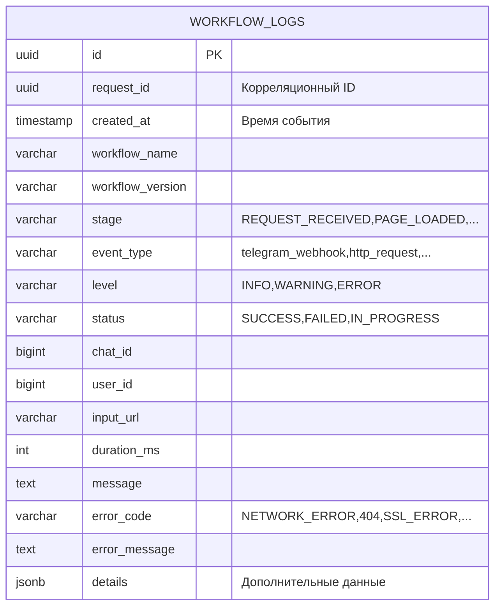
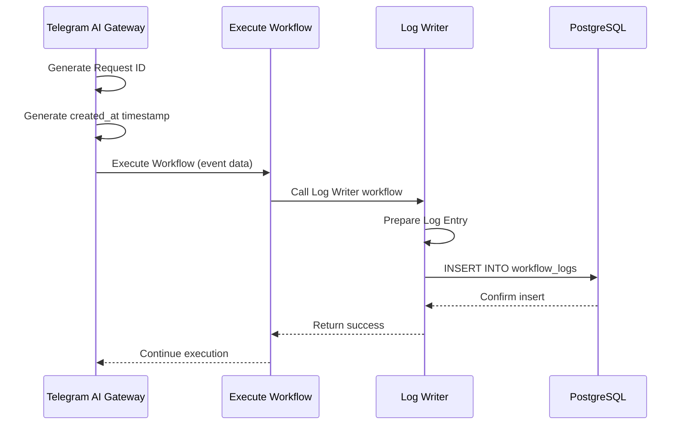
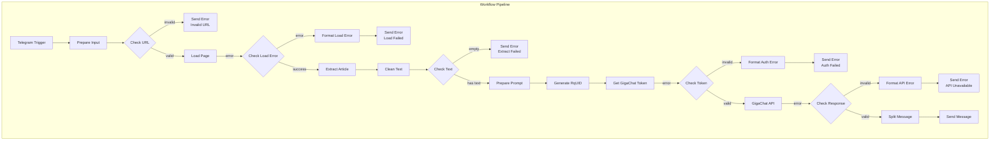
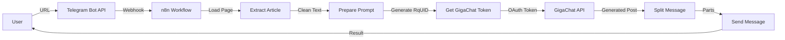
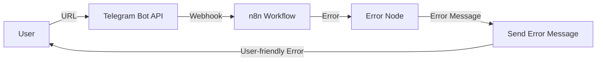
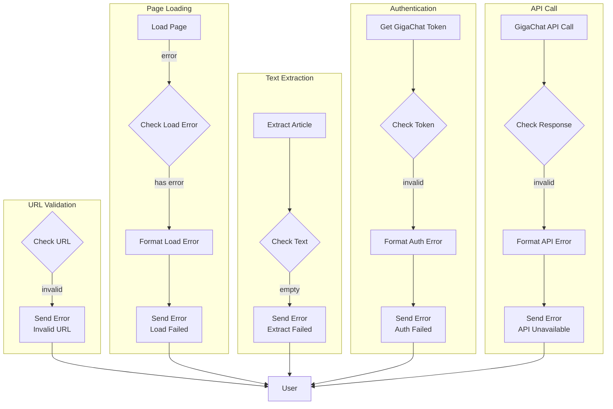

# 🏗️ Telegram AI Gateway · ARCHITECTURE



Единый документ архитектуры: внешние контуры (C4), внутреннее устройство workflow, журналирование исполнения, архитектурные решения и результаты инженерного тестирования.

> 📌 **Разделение ответственности:** пользовательские тексты сообщений об ошибках — [user_guide.md](user_guide.md), ограничения платформы и продукта — [limitations.md](limitations.md), развёртывание и эксплуатация — [deployment_guide.md](deployment_guide.md).

## 🌐 1. Context Diagram (C4 Level 1)



## 📦 2. Container Diagram (C4 Level 2)



### Docker Services

| Сервис | Образ | Назначение |
|--------|-------|-----------|
| n8n | n8nio/n8n:2.29.8 | Workflow engine |
| postgres | postgres:15-alpine | База данных n8n |

### n8n Workflows

| Workflow | Назначение | Ноды |
|----------|-----------|------|
| Telegram AI Gateway | Основной: приём ссылки → обработка → пост | 39 (28 основных + 11 Execute Workflow для логирования) |
| Telegram AI Gateway - Log Writer | Переиспользуемый: запись точек логирования | 4 (Execute Workflow → Log Writer → PostgreSQL) |

Триггер основного workflow — Telegram Trigger (On Message); режим обработки — event-driven, линейный конвейер с ответвлениями обработки ошибок.

### База данных

PostgreSQL 15 хранит credentials n8n, execution history, workflow definitions и таблицу `workflow_logs` для журналирования исполнения.

#### Архитектура данных



#### Поток записи логов



Запись асинхронная по смыслу конвейера: основной workflow вызывает Log Writer через Execute Workflow и продолжает исполнение; ошибки записи не прерывают обработку (Continue On Fail).

### Внешние интеграции

**Telegram Bot API:**
- Endpoint: `api.telegram.org`
- Методы: `getMe`, `sendMessage`
- Аутентификация: Bot Token

**GigaChat API:**
- OAuth endpoint: `ngw.devices.sberbank.ru:9443/api/v2/oauth`
- Chat endpoint: `gigachat.devices.sberbank.ru/api/v1/chat/completions`
- Аутентификация: Basic Auth → Bearer Token

## ⚙️ 3. Внутренняя структура основного workflow



### Основные ноды

| Нода | Тип | Назначение |
|------|-----|-----------|
| Telegram Trigger | Trigger | Приём сообщений (On Message) |
| Configuration | Set | Конфигурация прогона и тексты сообщений об ошибках |
| Prepare Input | Code | Извлечение URL и chat_id из webhook-данных |
| Generate Request ID | Code | `request_id` и `created_at` для всех точек логирования прогона |
| Check URL | IF | Валидация схемы (`http://` / `https://`) |
| Load Page | HTTP Request | Загрузка статьи (retry 3×1000ms) |
| Check Load Error | IF | Разбор ошибки загрузки (DNS / HTTP / SSL / таймаут) |
| Format Load Error | Set | Формирование сообщения об ошибке загрузки |
| Extract Article | HTML Extract | Извлечение текста статьи (несколько CSS-селекторов) |
| Clean Text | Code | Очистка (stop markers, regex), обрезка до `MAX_TEXT_LENGTH` |
| Check Text | IF | Проверка, что извлечён непустой текст |
| Prepare Prompt | Set | Сборка промпта, обрезка до `MAX_PROMPT_LENGTH` |
| Generate RqUID | Code | Уникальный ID запроса к GigaChat |
| Get GigaChat Token | HTTP Request | OAuth (retry 2×500ms) |
| Check Token | IF | Проверка результата OAuth |
| Format Auth Error | Set | Сообщение об ошибке авторизации |
| GigaChat API | HTTP Request | Chat Completions (retry 2×1000ms) |
| Check Response | IF | Проверка ответа AI-сервиса |
| Format API Error | Set | Сообщение об ошибке AI-сервиса |
| Split Message | Code | Разбиение поста по границам слов на части ≤ `MAX_MESSAGE_LENGTH` |
| Send Message | Telegram | Отправка частей пользователю |
| Send Error (*) | Telegram | Отправка сообщения об ошибке (5 вариантов по этапам) |

11 нод Execute Workflow вызывают Log Writer в точках логирования (§6).

### Конфигурация (переменные окружения)

Значения задаются в Configuration-ноде workflow; источник — переменные окружения n8n:

| Параметр | Назначение |
|----------|-----------|
| `GIGACHAT_MODEL` | Модель GigaChat (GigaChat-2-Max) |
| `GIGACHAT_TEMPERATURE` | Температура генерации (0.1 — минимум вариативности) |
| `MAX_TEXT_LENGTH` | Лимит текста статьи (12000 символов) |
| `MAX_PROMPT_LENGTH` | Лимит промпта (5000 символов) |
| `MAX_MESSAGE_LENGTH` | Лимит одного сообщения Telegram (4096) |
| `CODE_ENABLE_STDOUT` | Console-логирование Code-нод (`true` в отладке) |

### Retry-политики

Retry применяется только к временным сбоям внешних вызовов; на пользовательские ошибки (невалидный URL, пустой текст) и ошибки извлечения retry не распространяется — они завершаются конкретным сообщением пользователю.

| Нода | Попытки | Задержка |
|------|---------|----------|
| Load Page | 3 | 1000 ms |
| Get GigaChat Token | 2 | 500 ms |
| GigaChat API | 2 | 1000 ms |

## 🔄 4. Потоки данных

### Успешный сценарий



### Сценарий с ошибкой



## 🚨 5. Обработка ошибок

Три уровня обработки:

**1. Node Level:**
- Continue on Fail для HTTP Request нод
- Error output для критических нод

**2. Workflow Level:**
- Error flow для отправки сообщений об ошибках
- User-friendly error messages

**3. Retry Level:**
- Retry для Load Page, Get GigaChat Token, GigaChat (§3)
- Retry не применяется к валидационным ошибкам и ошибкам извлечения

### Error Flow Diagram



Полный каталог пользовательских сообщений (16 текстов) с причинами и действиями — [user_guide.md](user_guide.md), §3.

## 📊 6. Журналирование исполнения

### Схема

Основной workflow логирует события через ноды Execute Workflow, которые вызывают переиспользуемый Log Writer workflow; тот готовит запись и вставляет её в PostgreSQL (`workflow_logs`). Каждому прогону присваивается `request_id` (генерируется в Generate Request ID вместе с базовым `created_at`) — все события прогона коррелируются по нему.

### Контракт записи

Log Writer принимает JSON с полями записи (соответствуют схеме `workflow_logs`, §2):

```json
{
  "request_id": "uuid",
  "created_at": "ISO 8601 timestamp",
  "workflow_name": "Telegram AI Gateway",
  "workflow_version": "версия workflow",
  "stage": "PAGE_LOADED",
  "event_type": "http_request",
  "level": "INFO",
  "status": "SUCCESS",
  "chat_id": 123456789,
  "input_url": "https://...",
  "duration_ms": 1234,
  "message": "Человекочитаемое описание",
  "error_code": null,
  "error_message": null,
  "details": {}
}
```

`request_id` и `created_at` формируются в основном workflow и передаются в каждую точку логирования — это делает порядок записей прогона детерминированным (Log Writer не генерирует время сам).

### Точки логирования

| Этап конвейера | События (stage) | Level / Status |
|----------------|-----------------|----------------|
| Приём сообщения | `REQUEST_RECEIVED` | INFO / SUCCESS |
| Валидация URL | `URL_VALIDATED` | INFO / SUCCESS или FAILED |
| Загрузка страницы | `PAGE_LOADED`, `PAGE_LOAD_FAILED` | INFO–SUCCESS / ERROR–FAILED |
| Извлечение текста | `ARTICLE_EXTRACTED`, `ARTICLE_EXTRACT_FAILED` | INFO–SUCCESS / ERROR–FAILED |
| Авторизация GigaChat | `TOKEN_RECEIVED`, `TOKEN_FAILED` | INFO–SUCCESS / ERROR–FAILED |
| Генерация поста | `LLM_COMPLETED`, `LLM_FAILED` | INFO–SUCCESS / ERROR–FAILED |
| Отправка ответа | `TELEGRAM_SENT` | INFO / SUCCESS |
| Завершение прогона | `WORKFLOW_FINISHED` (успех), `WORKFLOW_FAILED` (сбой) | INFO / ERROR |

Обязательный минимум для наблюдаемости прогона: `REQUEST_RECEIVED`, точка сбоя (соответствующая `*_FAILED`), `WORKFLOW_FAILED` / `WORKFLOW_FINISHED`. Остальные точки дают детализацию по этапам. События failed-веток несут `error_code` (`NETWORK_ERROR`, `404`, `SSL_ERROR`, `AUTH_ERROR`, …) и `error_message` — пользовательский текст сообщения.

### Чтение журнала

```sql
-- Все события одного прогона в порядке наступления
SELECT created_at, stage, level, status, error_code, message
FROM workflow_logs
WHERE request_id = '<uuid>'
ORDER BY created_at;
```

Критерий работоспособности журналирования: для любого прогона в `workflow_logs` есть минимум одна запись на каждый пройденный этап, а по сбойному прогону — точка сбоя с `error_code` и `error_message`.

## 🧭 7. Архитектурные решения

Принятые решения спринта проектирования (полные ADR — в инженерном архиве лаборатории; здесь — суть и обоснование).

### 7.1. Минимальный контракт AI-провайдера

**Решение:** единый provider-independent контракт входа/выхода AI-этапа (`AI_PROVIDER` в конфигурации); конкретные ноды — под GigaChat (OAuth + Chat Completions).

**Обоснование:** изоляция провайдерной специфики в одном слое упрощает замену модели при сохранении остального конвейера. Полный Provider Adapter Pattern (адаптер на каждого провайдера, фабрика, реестр) признан избыточным для MVP — отложен до появления второго провайдера.

### 7.2. Независимость обработки контента от источника

**Решение:** конвейер разделён на слои Acquisition (получение контента по `CONTENT_SOURCE` — URL статьи) и Processing (извлечение, очистка, суммаризация). Слои обмениваются нормализованным контентом, обработка не знает источник.

**Обоснование:** добавление нового типа источника не затрагивает обработку; суммаризация не привязана к «загрузке по HTTP».

### 7.3. Слоистая структура workflow

**Решение:** основной workflow разделён на 8 слоёв: Input → Configuration → Validation → Content Acquisition → Content Processing → AI Provider → Response Handling → Error Handling. Каждый слой — своя группа нод с чёткой границей ответственности.

**Отклонённые альтернативы:** монолит без слоёв (потеря читаемости 39 нод) и дробление на sub-workflows по слоям (рост задержек и сложности отладки без выигрыша для MVP).

### 7.4. Переиспользуемые компоненты — определены, не вынесены

**Решение:** кандидаты на вынос в reusable-компоненты зафиксированы, но в MVP остаются внутри workflow.

**Кандидаты:** высокий потенциал — Prompt Builder, Split Message, Error Formatter; средний — Load/Extraction Strategy. Критерий выноса — второй потребитель того же компонента.

### 7.5. Журналирование исполнения через Log Writer

**Решение:** отдельный переиспользуемый workflow Log Writer (4 ноды) — единственная точка записи в `workflow_logs`; основной workflow вызывает его через Execute Workflow в точках логирования (§6).

**Обоснование:** единая схема записи, возможность смены хранилища без правки основного workflow, переиспользование журналирования в будущих workflow лаборатории.

## 🧪 8. Результаты инженерного тестирования

**Дата:** 2026-07-09. **Метод:** Deployment Validation + ручное тестирование через Telegram Bot API. **Окружение:** VPS, Docker Compose, n8n 2.29.8, PostgreSQL 15.

### Итоговая таблица

| # | Тест | URL | Статус | error_code |
|---|------|-----|--------|------------|
| 1 | DNS ошибка | `https://this-domain-does-not-exist-12345.com/article` | ✅ PASSED | `NETWORK_ERROR` |
| 2 | 404 | `https://habr.com/ru/articles/999999999/` | ✅ PASSED | `404` |
| 3 | Пустой текст | `https://example.org/` | ✅ PASSED | — |
| 4 | Timeout | `https://httpbin.org/delay/60` | ⚠️ НЕ ТЕСТИРОВАЛСЯ | — |
| 5 | SSL ошибка | `https://self-signed.badssl.com/` | ✅ PASSED | `SSL_ERROR` |
| 6 | 403 | `https://httpbin.org/status/403` | ✅ PASSED | `403` |
| 7 | 500 | `https://httpbin.org/status/500` | ✅ PASSED | `500` |
| 8 | GigaChat Auth | Неверный URL в Get GigaChat Token | ✅ PASSED | `AUTH_ERROR` |

### Подтверждённые маршруты в журнале

- **Ошибки загрузки (DNS, 404, SSL):** `REQUEST_RECEIVED` SUCCESS → `PAGE_LOAD_FAILED` FAILED с `error_code` и пользовательским текстом в `error_message`.
- **Ошибка авторизации GigaChat:** `REQUEST_RECEIVED` → `PAGE_LOADED` → `ARTICLE_EXTRACTED` SUCCESS → `TOKEN_FAILED` FAILED (`AUTH_ERROR`).
- **Успешный прогон:** `REQUEST_RECEIVED` → `PAGE_LOADED` → `ARTICLE_EXTRACTED` → `TOKEN_RECEIVED` → `LLM_COMPLETED` → `WORKFLOW_FINISHED`, все SUCCESS.

Пользовательские сообщения всех подтверждённых сценариев — [user_guide.md](user_guide.md), §3.

### Непроверенный сценарий

**Timeout:** `HTTP_LOAD_TIMEOUT = 30000ms` не сработал на `httpbin.org/delay/60` — требуется отдельная отладка timeout-механизма. Production не блокируется: retry-механизм работает корректно (проверен успешный retry после первой неудачи и исчерпание всех попыток с последующей отправкой ошибки).

### Исправленные в ходе тестирования проблемы

1. ✅ IF-нода Check Load Error — исправлено условие для object errors
2. ✅ Connections для `PAGE_LOADED` — логи записываются только при успехе
3. ✅ `error_code` как string — значения без префикса `=`
4. ✅ Инвертированный порядок логов — `created_at` детерминирован
5. ✅ Обработка SSL-ошибок — добавлена в Format Load Error

## 🔐 9. Безопасность

### Секреты

**Хранение:**
- Все секреты в `.env` файле
- `.env` добавлен в `.gitignore`
- n8n credentials в зашифрованном виде в PostgreSQL

**Переменные окружения:**
- `TELEGRAM_BOT_TOKEN` — токен Telegram-бота
- `GIGACHAT_AUTH_BASIC` — Base64-encoded GigaChat credentials
- `N8N_BASIC_AUTH_PASSWORD` — пароль для n8n admin

**Журналирование:** credentials не логируются; в `workflow_logs` попадают URL и коды ошибок, но не токены.

### Сетевая безопасность

**Требования:**
- HTTPS для webhook (опционально)
- HTTPS для внешних API
- Изоляция в Docker network

**Рекомендации:**
- IP whitelisting для n8n admin interface
- Reverse proxy (Nginx/Caddy) для HTTPS
- Firewall rules для ограничения доступа

## 📈 10. Масштабируемость и эксплуатация

### Текущие ограничения

- Один workflow instance (режим `regular`)
- PostgreSQL single instance
- Нет horizontal scaling

### Возможные улучшения (не в MVP)

- Redis для кэширования токена GigaChat и очереди запросов
- PostgreSQL replicas для чтения
- Queue mode n8n для высокой нагрузки
- Multiple n8n instances за load balancer

### Мониторинг

Текущий мониторинг (n8n execution history, Docker logs, structured logging) и рекомендуемый (Prometheus + Grafana, log aggregation, alerting) — [deployment_guide.md](deployment_guide.md), раздел «Мониторинг». Журналирование исполнения — §6 выше.

### Резервное копирование

Бэкапятся: PostgreSQL data volume, n8n data volume, `.env` (без секретов в git). Команды и процедура — [deployment_guide.md](deployment_guide.md), раздел «Бэкап и восстановление».

---

**Статус:** Актуальна (as-built)
**Последнее обновление:** 2026-09-16
**История изменений:** [📝 CHANGE_LOG.md](CHANGE_LOG.md#-1-история-изменений-документации)