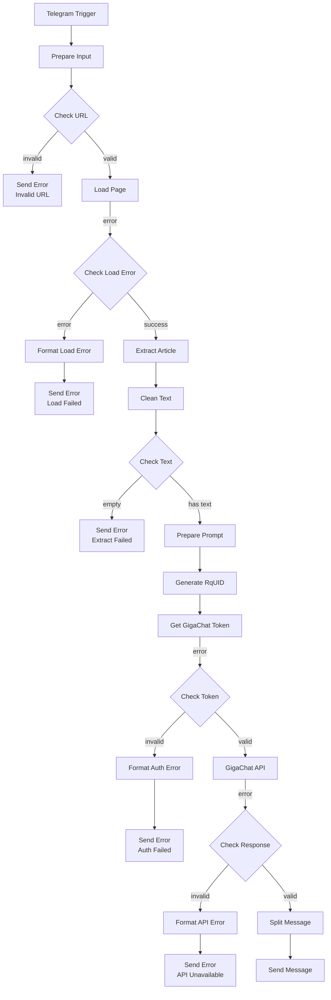

# Workflow Overview

Обзор workflow Telegram AI Gateway и связанных workflow.

## Версия

**Workflow JSON:** `workflows/Telegram AI Gateway.json`

**Статус:** ✅ Полностью функционален, протестирован вручную (E2E)

**Последнее обновление:** 2026-07-10

---

## Связанные workflows

### Telegram AI Gateway - Log Writer

**Файл:** `workflows/Telegram AI Gateway - Log Writer.json`

**Статус:** ✅ Создан (Phase 3 — Execution Logging)

**Назначение:** Отдельный reusable workflow для записи событий журналирования в PostgreSQL.

**Входной контракт:**
```json
{
  "request_id": "uuid",
  "workflow_name": "Telegram AI Gateway",
  "workflow_version": "...",
  "stage": "REQUEST_RECEIVED",
  "event_type": "telegram_webhook",
  "level": "INFO",
  "status": "SUCCESS",
  "chat_id": "...",
  "user_id": "...",
  "input_url": "...",
  "duration_ms": null,
  "message": "...",
  "error_code": null,
  "error_message": null,
  "details": {}
}
```

**Ноды:**
1. Prepare Log Entry — валидация и подготовка данных
2. Insert Log to PostgreSQL — запись в таблицу workflow_logs
3. Finalize Log Entry — подтверждение записи

**Документация:** `docs/logging-integration-guide.md`

---

## Диаграмма workflow



---

## Описание нод

### Основные ноды

#### 1. Telegram Trigger

**Тип:** `n8n-nodes-base.telegramTrigger`

**Назначение:** Получение сообщений из Telegram

**Параметры:**
- Trigger On: On Message
- Credentials: Telegram Bot Token

**Output:**
```json
{
  "message": {
    "text": "<URL>",
    "chat": {
      "id": 123456789
    }
  }
}
```

#### 2. Prepare Input

**Тип:** `n8n-nodes-base.set`

**Назначение:** Извлечение URL из сообщения

**Параметры:**
- Operation: Edit Fields
- Field: url
- Value: `={{ $json.message.text }}`

**Output:**
```json
{
  "url": "<URL>"
}
```

#### 3. Check URL

**Тип:** `n8n-nodes-base.if`

**Назначение:** Валидация формата URL

**Параметры:**
- Condition: `={{ $json.url }}` matches regex `^https?://`
- Operator: is true

**Branches:**
- true → Load Page
- false → Send Error (Invalid URL)

#### 4. Load Page

**Тип:** `n8n-nodes-base.httpRequest`

**Назначение:** Загрузка HTML-страницы

**Параметры:**
- Method: GET
- URL: `={{ $json.url }}`
- Response Format: String/Text
- Retry: 3 attempts, 1000ms interval
- Timeout: 30000ms
- Error Handling: Continue on Fail

**Output:**
```json
{
  "url": "<URL>",
  "data": "<HTML>",
  "error": { ... } // при ошибке
}
```

#### 5. Check Load Error

**Тип:** `n8n-nodes-base.if`

**Назначение:** Проверка ошибок загрузки страницы

**Параметры:**
- Condition: `={{ $json.error }}` is empty
- Operator: equals

**Branches:**
- true (no error) → Extract Article
- false (error) → Format Load Error

**Обрабатываемые ошибки:**
- DNS error (ENOTFOUND, DNS)
- Timeout (ETIMEDOUT, timeout)
- SSL/Certificate errors
- 404 Not Found
- 403 Forbidden
- 500 Server Error
- Connection refused (ECONNREFUSED)

#### 6. Extract Article

**Тип:** `n8n-nodes-base.htmlExtract`

**Назначение:** Извлечение текста статьи из HTML

**Параметры:**
- Source: Previous Node
- JSON Key: data
- Selector: `article`

**Output:**
```json
{
  "<dynamic_key>": "<article_text>"
}
```

**Примечание:** Текст может приходить как динамический ключ объекта.

#### 7. Clean Text

**Тип:** `n8n-nodes-base.code`

**Назначение:** Очистка текста от мусора и обрезка до лимита

**Логика:**
1. Извлечь текст из динамического ключа (Object.values)
2. Удалить мусор (regex patterns)
3. Удалить stop markers
4. Обрезать до 12000 символов
5. Логировать длину текста и усечение

**Logging:**
```javascript
console.log('[Clean Text] Input keys:', Object.keys($input.item.json));
console.log('[Clean Text] Original text length:', raw.length);
console.log('[Clean Text] Cleaned text length:', item.json.cleaned_text.length);
```

**Output:**
```json
{
  "cleaned_text": "<text>"
}
```

#### 8. Check Text

**Тип:** `n8n-nodes-base.if`

**Назначение:** Проверка наличия очищенного текста

**Параметры:**
- Condition: `={{ $json.cleaned_text }}` is not empty

**Branches:**
- true → Prepare Prompt
- false → Send Error (Extract)

#### 9. Prepare Prompt

**Тип:** `n8n-nodes-base.set`

**Назначение:** Формирование промпта для GigaChat

**Параметры:**
- Field: prompt
- Value: Динамический промпт с ограничением 5000 символов

**Output:**
```json
{
  "cleaned_text": "<text>",
  "prompt": "<prompt>"
}
```

#### 10. Generate RqUID

**Тип:** `n8n-nodes-base.code`

**Назначение:** Генерация UUID для запроса к GigaChat

**Логика:**
- Генерация UUID v4
- Сохранение всех предыдущих полей
- Логирование сгенерированного UID

**Logging:**
```javascript
console.log('[Generate RqUID] Generating request UID');
console.log('[Generate RqUID] Generated:', item.json.rq_uid);
```

**Output:**
```json
{
  "cleaned_text": "<text>",
  "prompt": "<prompt>",
  "rq_uid": "<uuid>"
}
```

#### 11. Get GigaChat Token

**Тип:** `n8n-nodes-base.httpRequest`

**Назначение:** Получение access token для GigaChat API

**Параметры:**
- Method: POST
- URL: `https://ngw.devices.sberbank.ru:9443/api/v2/oauth`
- Headers:
  - Authorization: Basic `<credentials>`
  - RqUID: `={{ $json.rq_uid }}`
  - Content-Type: `application/x-www-form-urlencoded`
- Body: `scope=GIGACHAT_API_PERS`
- Retry: 2 attempts, 500ms interval
- Timeout: 30000ms
- Error Handling: Continue on Fail

**Output:**
```json
{
  "access_token": "<token>",
  "expires_in": "<seconds>",
  "error": { ... } // при ошибке
}
```

#### 12. Check Token

**Тип:** `n8n-nodes-base.if`

**Назначение:** Проверка получения токена GigaChat

**Параметры:**
- Condition: `={{ $json.access_token }}` is not empty

**Branches:**
- true → GigaChat
- false → Format Auth Error

#### 13. GigaChat

**Тип:** `n8n-nodes-base.httpRequest`

**Назначение:** Генерация структурированного поста

**Параметры:**
- Method: POST
- URL: `https://gigachat.devices.sberbank.ru/api/v1/chat/completions`
- Headers:
  - Authorization: Bearer `={{ $json.access_token }}`
  - Content-Type: `application/json`
- Body:
  ```json
  {
    "model": "GigaChat-2-Max",
    "temperature": 0.1,
    "messages": [...]
  }
  ```
- Retry: 2 attempts, 1000ms interval
- Timeout: 60000ms
- Error Handling: Continue on Fail

**Output:**
```json
{
  "choices": [{
    "message": {
      "content": "<generated_post>"
    }
  }],
  "error": { ... } // при ошибке
}
```

#### 14. Check Response

**Тип:** `n8n-nodes-base.if`

**Назначение:** Проверка ответа GigaChat

**Параметры:**
- Condition: `={{ $json.choices }}` is not empty

**Branches:**
- true → Split Message
- false → Format API Error

#### 15. Split Message

**Тип:** `n8n-nodes-base.code`

**Назначение:** Разбиение длинных сообщений на части

**Логика:**
- Проверка длины сообщения (макс. 4096 символов)
- Разбиение по границам слов
- Нумерация частей (Часть 1/N)
- Логирование процесса разбиения

**Logging:**
```javascript
console.log('[Split Message] Processing response');
console.log('[Split Message] Content length:', content.length);
console.log('[Split Message] Total parts:', parts.length);
```

**Output:**
```json
{
  "text": "<part>",
  "part": 1,
  "total": 3,
  "chat_id": 123456789
}
```

#### 16. Send Message

**Тип:** `n8n-nodes-base.telegram`

**Назначение:** Отправка результата в Telegram

**Параметры:**
- Operation: Send Message
- Credentials: Telegram Bot Token
- Chat ID: `={{ $json.chat_id }}`
- Text: `={{ $json.text }}`
- Append Attribution: `false` (без подписи n8n)
- Disable Web Page Preview: `true`

### Ноды обработки ошибок

#### Send Error (Invalid URL)

**Тип:** `n8n-nodes-base.telegram`

**Сообщение:** "Пожалуйста, отправьте корректную ссылку на статью, начинающуюся с http:// или https://"

**Append Attribution:** `false`

#### Format Load Error

**Тип:** `n8n-nodes-base.code`

**Назначение:** Форматирование пользовательского сообщения об ошибке загрузки

**Логика:**
- Определение типа ошибки по statusCode и error.message
- Формирование понятного пользовательского сообщения
- Логирование ошибки

**Logging:**
```javascript
console.log('[Load Page Error] Status:', statusCode, 'Message:', error?.message);
```

**Output:**
```json
{
  "chat_id": 123456789,
  "error_message": "<user_friendly_message>",
  "error_code": "<status_code>"
}
```

**Пользовательские сообщения:**
- DNS error: "Ошибка DNS. Проверьте правильность домена в URL."
- Timeout: "Превышено время ожидания. Проверьте доступность сайта."
- SSL: "Ошибка SSL-сертификата. Сайт использует недостоверный сертификат."
- 404: "Страница не найдена (404). Проверьте правильность URL."
- 403: "Доступ запрещён (403). Страница недоступна для чтения."
- 500: "Ошибка сервера (500). Попробуйте позже."
- Connection refused: "Сервер недоступен. Сайт не отвечает на запросы."
- Default: "Не удалось загрузить страницу. Проверьте URL и повторите попытку."

#### Send Error (Load)

**Тип:** `n8n-nodes-base.telegram`

**Параметры:**
- Chat ID: `={{ $json.chat_id }}`
- Text: `={{ $json.error_message }}`
- Append Attribution: `false`

#### Send Error (Extract)

**Тип:** `n8n-nodes-base.telegram`

**Сообщение:** "Не удалось извлечь текст из статьи. Возможно, страница не содержит текстового контента."

**Append Attribution:** `false`

#### Format Auth Error

**Тип:** `n8n-nodes-base.code`

**Назначение:** Форматирование пользовательского сообщения об ошибке авторизации

**Логика:**
- Определение типа ошибки
- Формирование понятного сообщения

**Logging:**
```javascript
console.log('[Auth Error] Status:', statusCode, 'Message:', error?.message);
```

**Output:**
```json
{
  "chat_id": 123456789,
  "error_message": "Ошибка авторизации в сервисе. Обратитесь к администратору.",
  "error_code": "<status_code>"
}
```

#### Send Error (Auth)

**Тип:** `n8n-nodes-base.telegram`

**Параметры:**
- Chat ID: `={{ $json.chat_id }}`
- Text: `={{ $json.error_message }}`
- Append Attribution: `false`

#### Format API Error

**Тип:** `n8n-nodes-base.code`

**Назначение:** Форматирование пользовательского сообщения об ошибке GigaChat API

**Логика:**
- Определение типа ошибки по statusCode
- Формирование понятного сообщения

**Logging:**
```javascript
console.log('[GigaChat Error] Status:', statusCode, 'Message:', error?.message);
```

**Output:**
```json
{
  "chat_id": 123456789,
  "error_message": "<user_friendly_message>",
  "error_code": "<status_code>"
}
```

**Пользовательские сообщения:**
- 400: "Ошибка в запросе к AI-сервису. Попробуйте упростить текст."
- 401: "Ошибка авторизации в AI-сервисе. Обратитесь к администратору."
- 429: "Превышен лимит запросов к AI-сервису. Попробуйте через минуту."
- 500+: "AI-сервис временно недоступен. Попробуйте позже."
- Default: "Сервис временно недоступен. Попробуйте позже."

#### Send Error (API)

**Тип:** `n8n-nodes-base.telegram`

**Параметры:**
- Chat ID: `={{ $json.chat_id }}`
- Text: `={{ $json.error_message }}`
- Append Attribution: `false`

---

## Обработка ошибок

### Retry политики

| Нода | Попытки | Интервал | Backoff | Условия |
|------|---------|---------|---------|---------|
| Load Page | 3 | 1000ms | Linear | Network errors, timeouts |
| Get GigaChat Token | 2 | 500ms | Linear | Auth errors, API errors |
| GigaChat | 2 | 1000ms | Linear | API errors, timeouts |

### Retry логика

**Load Page:**
- Попытка 1: немедленно
- Попытка 2: через 1000ms
- Попытка 3: через 1000ms

**Get GigaChat Token:**
- Попытка 1: немедленно
- Попытка 2: через 500ms

**GigaChat:**
- Попытка 1: немедленно
- Попытка 2: через 1000ms

### Retry НЕ применяется к

- Ошибкам пользователя (невалидный URL)
- Ошибкам prompt (контент-ошибки)
- Ошибкам извлечения текста (NO_TEXT_EXTRACTED)

### Error Flow

```
[Load Page Error]
        │
        ▼
[Check Load Error] ───[false]──→ [Format Load Error]
        │ [true]                        │
        ▼                               ▼
[Extract Article]              [Send Error (Load)]
        │
        ▼
[Check Text Error]
        │
        ▼
[Send Error (Extract)]

[Auth Error]
        │
        ▼
[Check Token] ───[false]──→ [Format Auth Error]
        │ [true]                    │
        ▼                           ▼
[GigaChat]                  [Send Error (Auth)]
        │
        ▼
[API Error]
        │
        ▼
[Check Response] ───[false]──→ [Format API Error]
        │ [true]                       │
        ▼                              ▼
[Split Message]              [Send Error (API)]
```

---

## Логирование

Система логирования реализована через отдельный Log Writer workflow с записью в PostgreSQL.

**Архитектура логирования:**
- Отдельный reusable workflow "Telegram AI Gateway - Log Writer"
- Execute Workflow nodes на всех критических этапах
- PostgreSQL таблица workflow_logs
- Request ID для корреляции логов одного запроса

**Точки логирования:**
- REQUEST_RECEIVED — получение URL от пользователя
- PAGE_LOADED / PAGE_LOAD_FAILED — загрузка страницы
- TEXT_EXTRACTED — извлечение текста
- TOKEN_RECEIVED / TOKEN_FAILED — авторизация GigaChat
- LLM_COMPLETED / LLM_FAILED — генерация поста
- TELEGRAM_SENT / WORKFLOW_FAILED — отправка результата

**Подробная документация:** [logging-integration-guide.md](logging-integration-guide.md)

**Console Logging в Code нодах:**
```javascript
console.log('[Node Name] Action description');
console.log('[Node Name] Key data:', value);
```

**Включение console.log:** `CODE_ENABLE_STDOUT=true` в docker-compose.yml

**n8n Execution History:** Все выполнения сохраняются в n8n execution history и доступны через n8n UI.

---

## Ограничения

### Telegram API

- Максимальная длина сообщения: 4096 символов
- Rate limits: 30 сообщений/секунду в один чат

### GigaChat API

- Token lifetime: ~30 минут
- Rate limits: определяются тарифом

### Workflow

- Максимальная длина текста: 12000 символов
- Максимальная длина промпта: 5000 символов
- Максимальная длина сообщения: 4096 символов

---

## Переменные окружения

Workflow использует следующие переменные из `.env`:

| Переменная | Использование |
|-----------|-------------|
| `GIGACHAT_MODEL` | Модель GigaChat |
| `GIGACHAT_TEMPERATURE` | Температура модели |
| `MAX_TEXT_LENGTH` | Макс. длина текста |
| `MAX_PROMPT_LENGTH` | Макс. длина промпта |
| `MAX_MESSAGE_LENGTH` | Макс. длина сообщения |
| `CODE_ENABLE_STDOUT` | Включить вывод console.log |

---

## Credentials

Workflow требует следующие credentials:

1. **Telegram Bot Token** — токен от @BotFather
2. **GigaChat Basic Auth** — Base64-encoded client_id:client_secret

---

## Мониторинг

### n8n Execution History

Все выполнения workflow сохраняются в n8n execution history и доступны через n8n UI.

### Structured Logging

Структурированные логи через `console.log` в Code нодах с префиксом `[Node Name]`.

### Error Tracking

Все ошибки логируются с контекстом:
- Node name
- Error code
- Error message
- User-friendly message

---

## Рекомендации

### Оптимизация

- Используйте polling для разработки
- Используйте webhook для production
- Кэшируйте GigaChat token (не реализовано в MVP)
- Ограничивайте одновременные выполнения

### Безопасность

- Не логируйте credentials
- Не передавайте токены в сообщениях
- Используйте HTTPS для webhook
- Регулярно ротируйте токены
- Установите `CODE_ENABLE_STDOUT=true` для логирования

### Диагностика

- Проверяйте n8n execution history
- Анализируйте логи Code нод
- Проверяйте статусы HTTP запросов
- Мониторьте retry attempts

---

## Изменения

| Дата | Версия | Изменения |
|------|--------|-----------|
| 2026-07-08 | 2.0 | Добавлена полноценная обработка ошибок: Check Load Error, Check Token, Check Response; Format Error ноды; Retry; Logging; n8n attribution removed |
| 2026-07-08 | 1.0 | Начальная версия workflow |